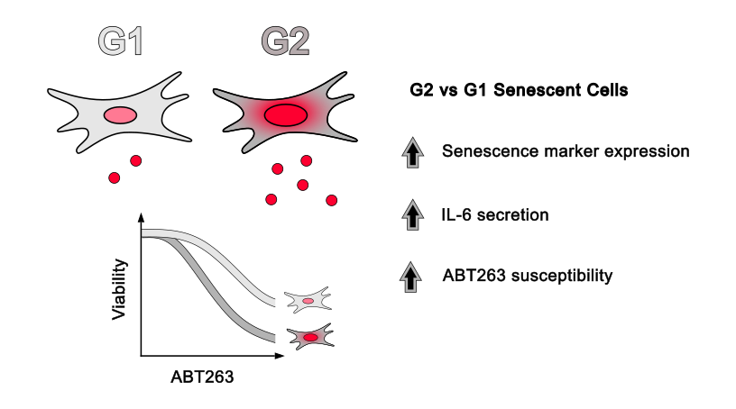
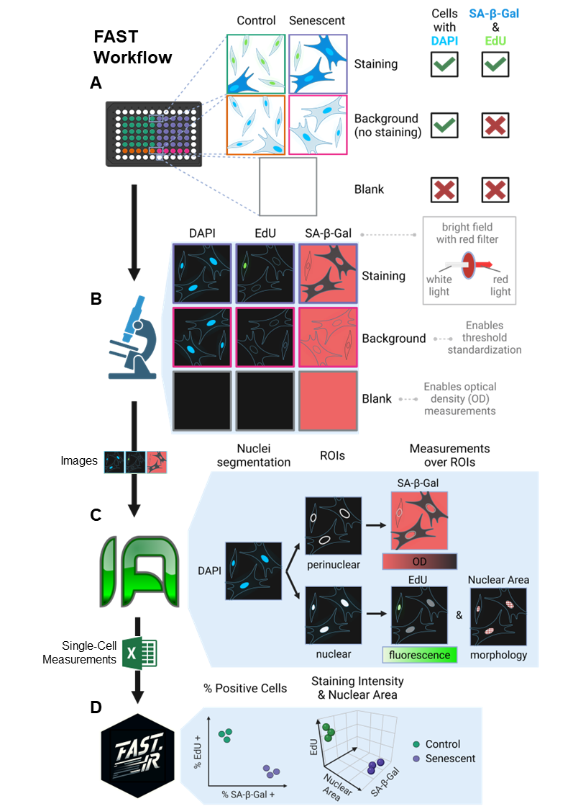
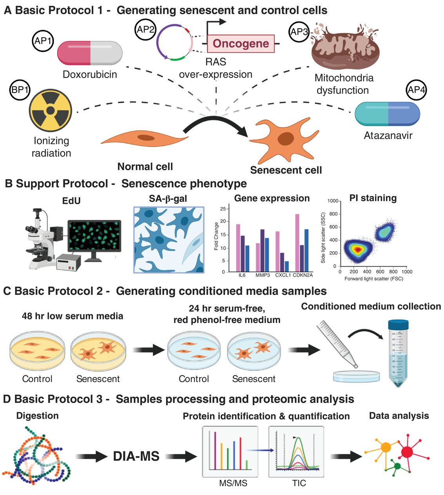
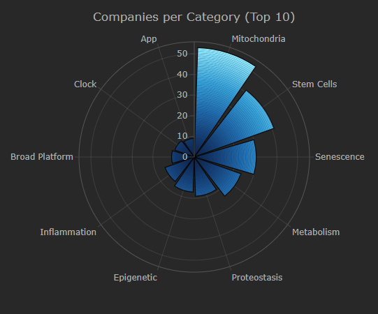

------------------------------------------------------------------------

 

## Academic Projects

#### Senescent cell heterogeneity and responses to senolytic treatment are related to cell cycle status during senescence induction

::: {#senescence-heterogeneity .project layout="[4,6]"}

Using high-content imaging, we identified subpopulations of senescent cells that secrete different levels of pro-inflammatory cytokines and have different reponses to senolytic treatment.
:::

 

#### A Fully-Automated Senescence Test (FAST) for the high-throughput quantification of senescence-associated markers

::: {#FAST .project layout="[4,6]"}

We developed FAST, an image-based method for the high-throughput, single-cell assessment of senescence in cultured cells.
:::

 

#### Quantitative Proteomic Analysis of the Senescence-Associated Secretory Phenotype by Data-Independent Acquisition

::: {#SASP-protocol .project layout="[4,6]"}

We describe protocols to (1) generate senescent cells using different stimuli, (2) collect conditioned medium containing proteins secreted by senescent cells (i.e., SASP), and (3) prepare the SASP for quantitative proteomic analysis
:::

 

## Other Projects

#### Longevity Biotech Insights (LBI)

::: {#lbi-project .project layout="[4,6]"}

::: {.project-text}
[Longevity Biotech Insights dashboard](/lbi/) \| [GitHub Repository](https://github.com/f-neri/longevity_biotech_insights)

Longevity Biotech Insights is an interactive dashboard and data pipeline that tracks 250+ aging/longevity biotech companies worldwide using data from AgingBiotech.info. It lets users explore the ecosystem by founding year, research category, clinical stage, and geography, with click-through company-level details. The project includes an automated weekly data-refresh workflow to keep published data artifacts up to date.
:::
:::